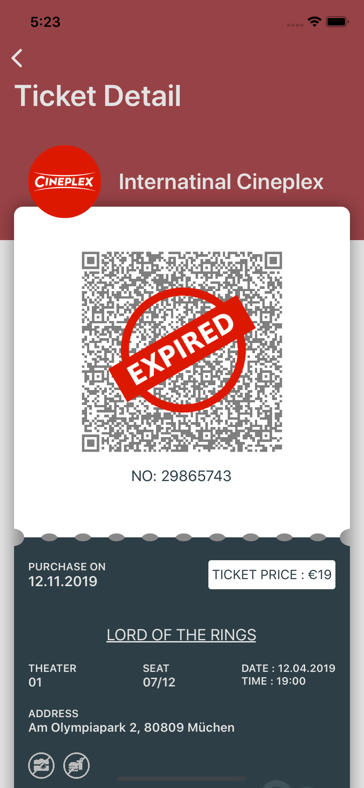

**Online e-ticket system in Xamarin.Form**

It is a simple application that has a list of tickets. It is just a dummy application for demonstrating Xamarin.Form. Expo is used to develop the application. It covers implementation of:

MasterDetail Page

SkiaSharp for graphic

QR code

Simple animation

MVVM

Material icons

CustomControls using Custom Renderer

DataTemplateSelector

Behaviors

Converters

**Packages used**

- Newonsoft.Json
- PropertyChanged.Fody
- QRCoder
- Rg.Plugins.Popup
- SkiaSharp
- Xamarin.Forms.PancakeView

**UI Design**
<table>
  <tr>
    <td></td>
    <td></td>
    <td></td>
  </tr>
   <tr>
    <td></td>
    <td></td>
    <td></td>
  </tr>
   <tr>
    <td></td>
    <td></td>
    <td></td>
  </tr>
 </table>
